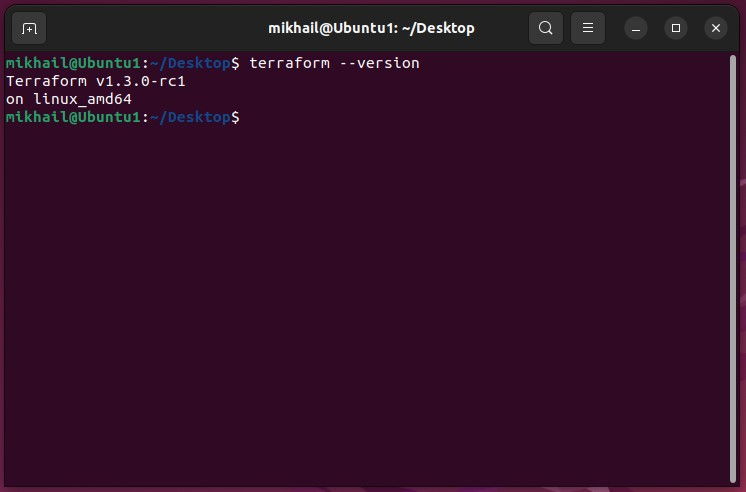
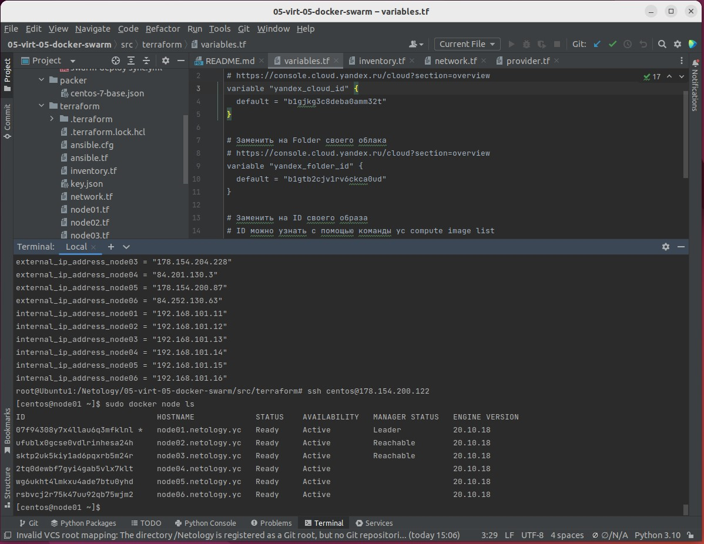
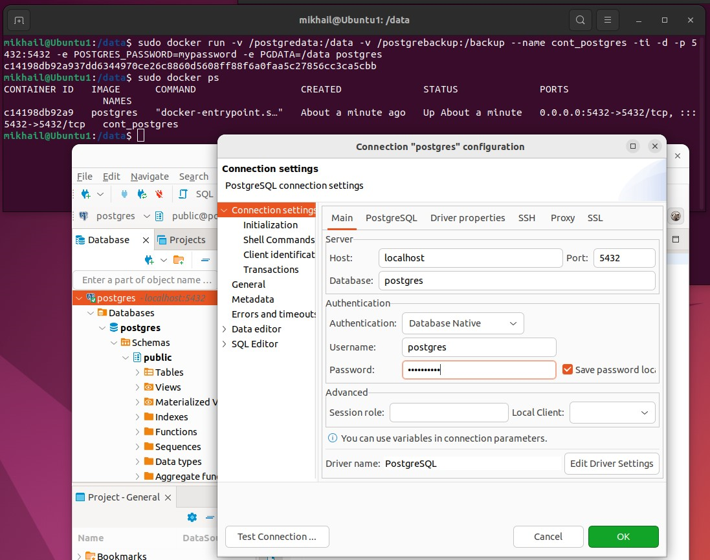
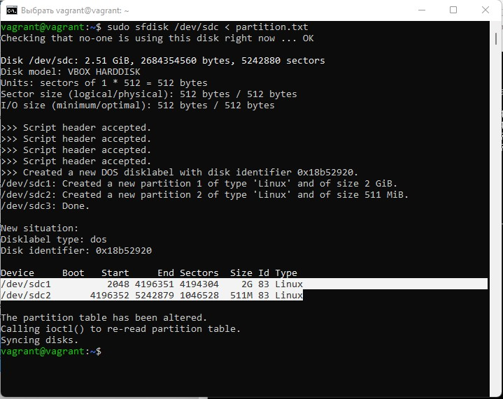

## Домашнее задание к занятию 5.5. Оркестрация кластером Docker контейнеров на примере Docker Swarm ##

### Задача 1 ###

#### Дайте письменые ответы на следующие вопросы: ####

#### В чём отличие режимов работы сервисов в Docker Swarm кластере: replication и global? ####

В случае режима replication явно указывается количество реплик сервиса , которое должно быть развёрнуто. В случае режима global разворачивается по одной реплике на каждом доступном узле кластера.

#### Какой алгоритм выбора лидера используется в Docker Swarm кластере? ####

Raft Consensus Algorithm - алгоритм для решения задач консенсуса в сети ненадёжных вычислений, который позволяет нескольким участникам совместно решить, произошло ли событие или нет, и что за чем следовало.

#### Что такое Overlay Network? ####

Это логическая сеть, созданная поверх сети хоста. Создаёт распределенную сеть между несколькими узлами Docker, позволяя контейнерам, подключенным к ней, безопасно обмениваться данными

### Задача 2 ###

#### Создать ваш первый Docker Swarm кластер в Яндекс.Облаке ####

#### Для получения зачета, вам необходимо предоставить скриншот из терминала (консоли), с выводом команды: docker node ls ####

### Задача 3 ###

#### Создать ваш первый, готовый к боевой эксплуатации кластер мониторинга, состоящий из стека микросервисов. ####
#### Для получения зачета, вам необходимо предоставить скриншот из терминала (консоли), с выводом команды: docker service ls ####

