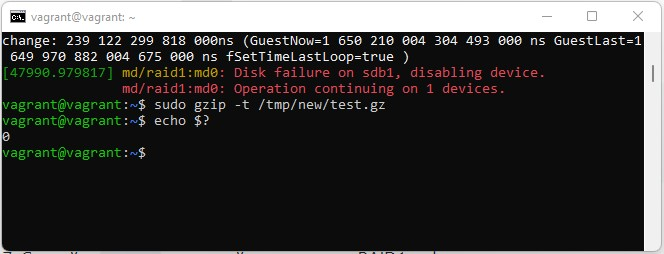

**_2. Могут ли файлы, являющиеся жесткой ссылкой на один объект, иметь разные права доступа и владельца? Почему?_**

Не могут, так как права являются параметрами объекта inode , а ссылки являются лишь дополнительными именами данного объекта

**_Сделайте vagrant destroy на имеющийся инстанс Ubuntu. Замените содержимое Vagrantfile следующим: Данная конфигурация создаст новую виртуальную машину с двумя дополнительными неразмеченными дисками по 2.5 Гб._**

**_4. Используя fdisk, разбейте первый диск на 2 раздела: 2 Гб, оставшееся пространство._**

**_5. Используя sfdisk, перенесите данную таблицу разделов на второй диск._**

**_6. Соберите mdadm RAID1 на паре разделов 2 Гб._**

**_7. Соберите mdadm RAID0 на второй паре маленьких разделов._**

**_8. Создайте 2 независимых PV на получившихся md-устройствах._**

**_9. Создайте общую volume-group на этих двух PV._**

**_10. Создайте LV размером 100 Мб, указав его расположение на PV с RAID0._**

**_11. Создайте mkfs.ext4 ФС на получившемся LV._**

**_12. Смонтируйте этот раздел в любую директорию, например, /tmp/new_**

**_13. Поместите туда тестовый файл, например wget https://mirror.yandex.ru/ubuntu/ls-lR.gz -O /tmp/new/test.gz_**

**_14. Прикрепите вывод lsblk_**

**_15. Протестируйте целостность файла:_**

**_16. Используя pvmove, переместите содержимое PV с RAID0 на RAID1._**

**_17. Сделайте --fail на устройство в вашем RAID1 md._**

**_18. Подтвердите выводом dmesg, что RAID1 работает в деградированном состоянии._**

**_19. Протестируйте целостность файла, несмотря на "сбойный" диск он должен продолжать быть доступен:_**

