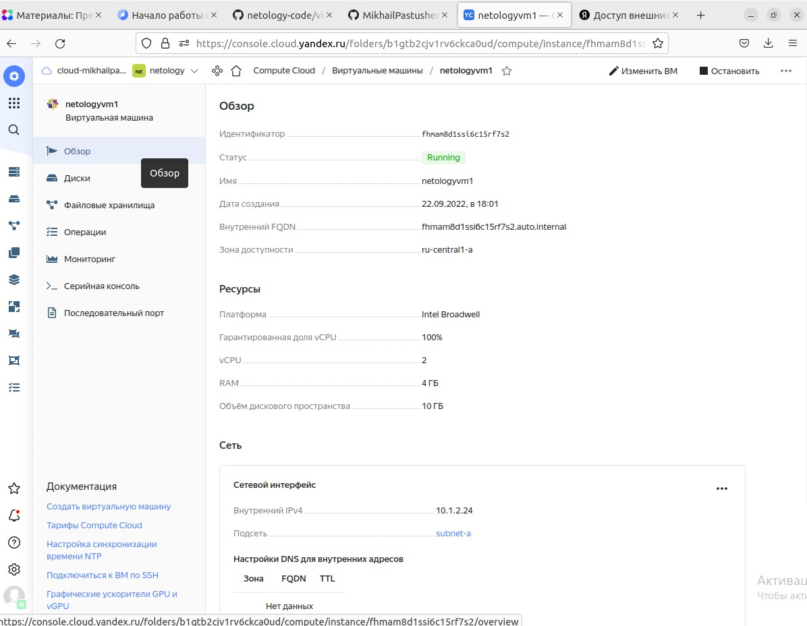
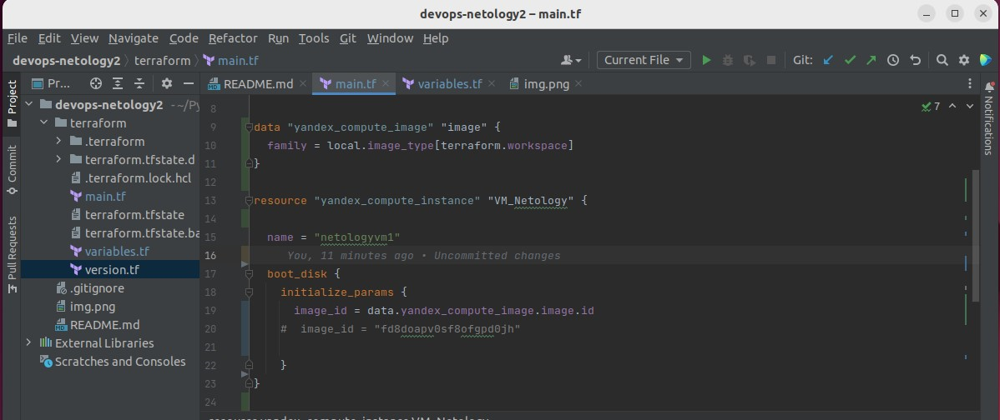
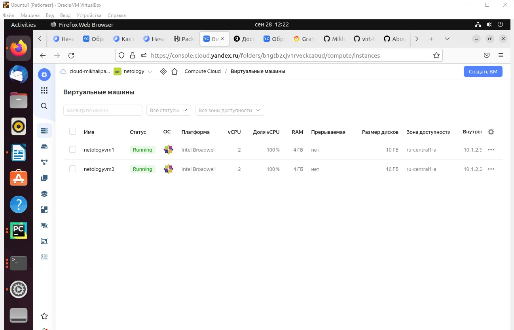

## Домашнее задание к занятию 6.3 MYSQL ##

### Задача 1 ###

#### Используя docker поднимите инстанс MySQL (версию 8). Данные БД сохраните в volume. ####

#### Изучите бэкап БД и восстановитесь из него.  ####

#### Перейдите в управляющую консоль mysql внутри контейнера. ####
#### Используя команду \h получите список управляющих команд. ####

### Найдите команду для выдачи статуса БД и приведите в ответе из ее вывода версию сервера БД. ####

#### Подключитесь к восстановленной БД и получите список таблиц из этой БД. ####
#### Приведите в ответе количество записей с price > 300. ####

### Задача 2 ###

#### Создайте пользователя test в БД c паролем test-pass, используя: ####
 #### плагин авторизации mysql_native_password ####
 #### срок истечения пароля - 180 дней ####
 #### количество попыток авторизации - 3 ####
 #### максимальное количество запросов в час - 100 ####
 #### аттрибуты пользователя: ####
 #### Фамилия "Pretty" ####
 #### Имя "James" ####

#### Предоставьте привелегии пользователю test на операции SELECT базы test_db #### 
#### Используя таблицу INFORMATION_SCHEMA.USER_ATTRIBUTES получите данные по пользователю test и приведите в ответе к задаче ####

 

### Задача 3 ###

#### Установите профилирование SET profiling = 1. Изучите вывод профилирования команд SHOW PROFILES; ####

#### Исследуйте, какой engine используется в таблице БД test_db и приведите в ответе. ####
#### Измените engine и приведите время выполнения и запрос на изменения из профайлера в ответе: ####

### Задача 4 ###

#### Изучите файл my.cnf в директории /etc/mysql. ####
#### Измените его согласно ТЗ (движок InnoDB): #### 

#### - Скорость IO важнее сохранности данных ####
#### - Нужна компрессия таблиц для экономии места на диске ####
#### - Размер буффера с незакомиченными транзакциями 1 Мб ####
#### - Буффер кеширования 30% от ОЗУ ####
#### - Размер файла логов операций 100 Мб ####

К сожалению в образе контейнера mysql нет втроенных редакторов, поэтому менял нужные параметры командами

Но как видно из скриншота, параметр производительности и размер файла логов операций таким образом не удалось перезаписать на ходу. Надеюсь, это не повлияет на оценивание, так как вроде бы не имеет принципиального отношения к сути задания. 
