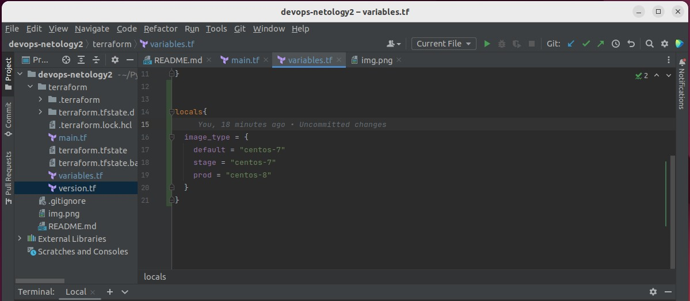

**_4. С помощью базового файла конфигурации запустите Ubuntu 20.04 в VirtualBox посредством Vagrant:_**

vagrant init

vagrant up

**_5. Ознакомьтесь с графическим интерфейсом VirtualBox, посмотрите как выглядит виртуальная машина, которую создал для вас Vagrant, какие аппаратные ресурсы ей выделены. Какие ресурсы выделены по-умолчанию?_**

**_6. Ознакомьтесь с возможностями конфигурации VirtualBox через Vagrantfile: документация. Как добавить оперативной памяти или ресурсов процессора виртуальной машине?_**

**_7. Команда vagrant ssh из директории, в которой содержится Vagrantfile, позволит вам оказаться внутри виртуальной машины без каких-либо дополнительных настроек. Попрактикуйтесь в выполнении обсуждаемых команд в терминале Ubuntu.
Ознакомиться с разделами man bash, почитать о настройках самого bash:_**

8**_. Ознакомиться с разделами man bash, почитать о настройках самого bash:
какой переменной можно задать длину журнала history, и на какой строчке manual это описывается?_**

HISTSIZE 

**_что делает директива ignoreboth в bash?_**

Устанавливает флаги ignoredups и ignorespace

**_9. В каких сценариях использования применимы скобки {} и на какой строчке man bash это описано?_**

Для генерации набора строк, имён файлов 

_**10. С учётом ответа на предыдущий вопрос, как создать однократным вызовом touch 100000 файлов? Получится ли аналогичным образом создать 300000? Если нет, то почему?**_

touch file{1..100000}

touch file{1..300000}

**_11. В man bash поищите по /\[\[. Что делает конструкция [[ -d /tmp ]]_**

Логическое выражение равное true, если директория /temp существует 

12. Основываясь на знаниях о просмотре текущих (например, PATH) и установке новых переменных; командах, которые мы рассматривали, добейтесь в выводе type -a bash в виртуальной машине наличия первым пунктом в списке:

bash is /tmp/new_path_directory/bash

bash is /usr/local/bin/bash

bash is /bin/bash

**_13. Чем отличается планирование команд с помощью batch и at?_**

at выполнит команду в заданное время, а batch - когда уровень загрузки будет ниже определённого

_**14. Завершите работу виртуальной машины чтобы не расходовать ресурсы компьютера и/или батарею ноутбука**_

vagrant halt

