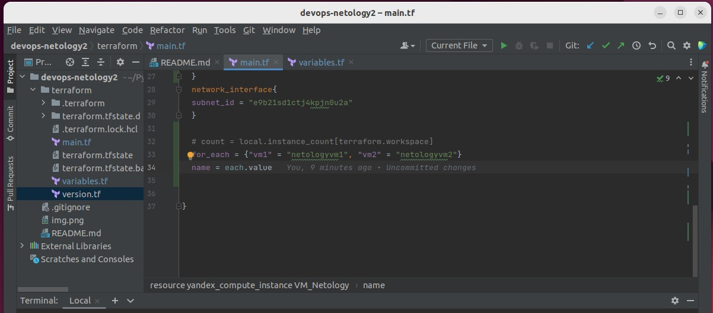

**_1. Работа c HTTP через телнет. Подключитесь утилитой телнет к сайту stackoverflow.com telnet stackoverflow.com 80. В ответе укажите полученный HTTP код, что он означает?_**

Был возвращён код  301 Moved Permanently , который означает что запрошенный ресурс был  перемещён в новое месторасположение.

**_2. Повторите задание 1 в браузере, используя консоль разработчика F12_**

Код 307

Самый длинный запрос: 285 ms

**_3. Какой IP адрес у вас в интернете?_**

**_4. Какому провайдеру принадлежит ваш IP адрес? Какой автономной системе AS? Воспользуйтесь утилитой whois_**

**_5. Через какие сети проходит пакет, отправленный с вашего компьютера на адрес 8.8.8.8? Через какие AS? Воспользуйтесь утилитой traceroute_**

**_6. Повторите задание 5 в утилите mtr. На каком участке наибольшая задержка - delay?_**

Наибольшая задержка на 3 участке

**_7. Какие DNS сервера отвечают за доменное имя dns.google? Какие A записи? воспользуйтесь утилитой dig_**

**_8. Проверьте PTR записи для IP адресов из задания 7. Какое доменное имя привязано к IP? воспользуйтесь утилитой dig_**

