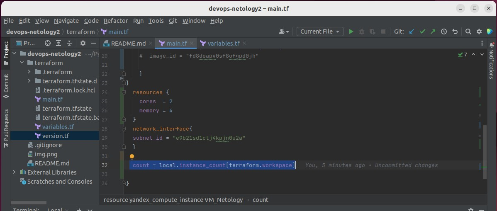

## Домашнее задание к занятию 6.2 SQL ##

### Задача 1 ###

#### Используя docker поднимите инстанс PostgreSQL (версию 12) c 2 volume, в который будут складываться данные БД и бэкапы. Приведите получившуюся команду или docker-compose манифест. ####

### Задача 2 ###

#### создайте пользователя test-admin-user и БД test_db ####

#### в БД test_db создайте таблицу orders и clients (спeцификация таблиц ниже) ####

#### предоставьте привилегии на все операции пользователю test-admin-user на таблицы БД test_db ####
#### создайте пользователя test-simple-user ####
#### предоставьте пользователю test-simple-user права на SELECT/INSERT/UPDATE/DELETE данных таблиц БД test_db #### 

#### итоговый список БД после выполнения пунктов выше ####

#### SQL-запрос для выдачи списка пользователей с правами над таблицами test_db ####

### Задача 3 ###

#### Используя SQL синтаксис - наполните таблицы следующими тестовыми данными: ####

#### вычислите количество записей для каждой таблицы ####

### Задача 4 ###

#### Часть пользователей из таблицы clients решили оформить заказы из таблицы orders. ####
#### Используя foreign keys свяжите записи из таблиц, согласно таблице: ####

#### Приведите SQL-запрос для выдачи всех пользователей, которые совершили заказ, а также вывод данного запроса. ####

### Задача 5 ###

#### Получите полную информацию по выполнению запроса выдачи всех пользователей из задачи 4 (используя директиву EXPLAIN). ####
#### Приведите получившийся результат и объясните что значат полученные значения ####

0.00 - время необходимое для того чтобы начать выводить данные

1.04 - ожидаемое время полного вывода данных

Rows=4 - ожидаемое число выводимых строк

Width=164 - ожидаемый средний размер строк

### Задача 6 ###

#### Создайте бэкап БД test_db и поместите его в volume, предназначенный для бэкапов (см. Задачу 1). ####

#### Поднимите новый пустой контейнер с PostgreSQL. ####

#### Восстановите БД test_db в новом контейнере. ####

