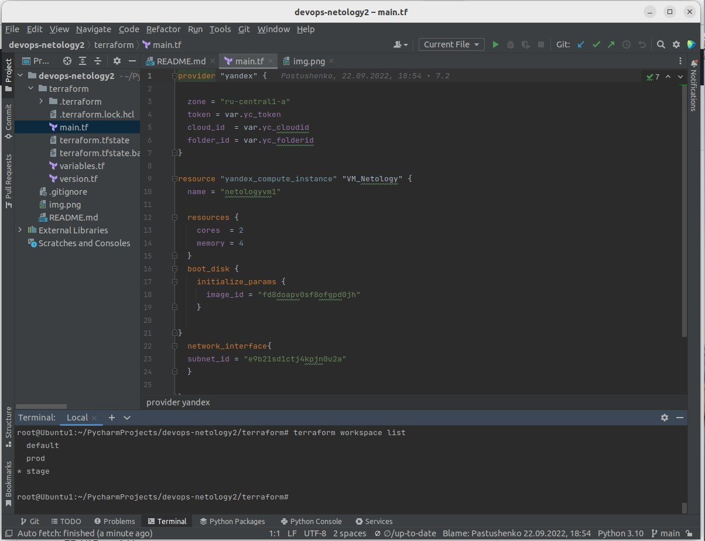

## Домашнее задание к занятию "7.3.Основы и принцип работы Терраформ" ##

Делаю вариант с ЯндексОблаком

### Задача 2. Инициализируем проект и создаем воркспейсы ###

#### 1. Выполните terraform init ####

   

#### 2. Создайте два воркспейса stage и prod ####
   



#### 3. В уже созданный aws_instance добавьте зависимость типа инстанса от вокспейса, что бы в разных ворскспейсах использовались разные instance_type ####


Так как работаю не с AWS,а с ЯндексОблаком сделал не разные instance_type, а например разные типы образов.

Добавил переменную для типа образа


и зависимость образа от workspace


Вывод команды terraform plan
```
root@Ubuntu1:~/PycharmProjects/devops-netology2/terraform# terraform plan
data.yandex_compute_image.image: Reading...
data.yandex_compute_image.image: Read complete after 0s [id=fd86tafe9jg6c4hd2aqp]

Terraform used the selected providers to generate the following execution plan. Resource actions are indicated with the following symbols:
  + create

Terraform will perform the following actions:

  # yandex_compute_instance.VM_Netology will be created
  + resource "yandex_compute_instance" "VM_Netology" {
      + created_at                = (known after apply)
      + folder_id                 = (known after apply)
      + fqdn                      = (known after apply)
      + hostname                  = (known after apply)
      + id                        = (known after apply)
      + name                      = "netologyvm1"
      + network_acceleration_type = "standard"
      + platform_id               = "standard-v1"
      + service_account_id        = (known after apply)
      + status                    = (known after apply)
      + zone                      = (known after apply)

      + boot_disk {
          + auto_delete = true
          + device_name = (known after apply)
          + disk_id     = (known after apply)
          + mode        = (known after apply)

          + initialize_params {
              + block_size  = (known after apply)
              + description = (known after apply)
              + image_id    = "fd86tafe9jg6c4hd2aqp"
              + name        = (known after apply)
              + size        = (known after apply)
              + snapshot_id = (known after apply)
              + type        = "network-hdd"
            }
        }

      + network_interface {
          + index              = (known after apply)
          + ip_address         = (known after apply)
          + ipv4               = true
          + ipv6               = (known after apply)
          + ipv6_address       = (known after apply)
          + mac_address        = (known after apply)
          + nat                = (known after apply)
          + nat_ip_address     = (known after apply)
          + nat_ip_version     = (known after apply)
          + security_group_ids = (known after apply)
          + subnet_id          = "e9b21sd1ctj4kpjn0u2a"
        }

      + placement_policy {
          + host_affinity_rules = (known after apply)
          + placement_group_id  = (known after apply)
        }

      + resources {
          + core_fraction = 100
          + cores         = 2
          + memory        = 4
        }

      + scheduling_policy {
          + preemptible = (known after apply)
        }
    }

Plan: 1 to add, 0 to change, 0 to destroy.
```

#### 4. Добавим count. Для stage должен создаться один экземпляр ec2, а для prod два. ####

Добавил переменную для количества инстансов


и зависимость количества инстансов от workspace


Вывод команды terraform plan
```
root@Ubuntu1:~/PycharmProjects/devops-netology2/terraform# terraform workspace select prod
Switched to workspace "prod".
root@Ubuntu1:~/PycharmProjects/devops-netology2/terraform# terraform plan

Terraform used the selected providers to generate the following execution plan. Resource actions are indicated with the following symbols:
  + create

Terraform will perform the following actions:

  # yandex_compute_instance.VM_Netology[0] will be created
  + resource "yandex_compute_instance" "VM_Netology" {
      + created_at                = (known after apply)
      + folder_id                 = (known after apply)
      + fqdn                      = (known after apply)
      + hostname                  = (known after apply)
      + id                        = (known after apply)
      + name                      = "netologyvm1"
      + network_acceleration_type = "standard"
      + platform_id               = "standard-v1"
      + service_account_id        = (known after apply)
      + status                    = (known after apply)
      + zone                      = (known after apply)

      + boot_disk {
          + auto_delete = true
          + device_name = (known after apply)
          + disk_id     = (known after apply)
          + mode        = (known after apply)

          + initialize_params {
              + block_size  = (known after apply)
              + description = (known after apply)
              + image_id    = "fd8doapv0sf8ofgpd0jh"
              + name        = (known after apply)
              + size        = (known after apply)
              + snapshot_id = (known after apply)
              + type        = "network-hdd"
            }
        }

      + network_interface {
          + index              = (known after apply)
          + ip_address         = (known after apply)
          + ipv4               = true
          + ipv6               = (known after apply)
          + ipv6_address       = (known after apply)
          + mac_address        = (known after apply)
          + nat                = (known after apply)
          + nat_ip_address     = (known after apply)
          + nat_ip_version     = (known after apply)
          + security_group_ids = (known after apply)
          + subnet_id          = "e9b21sd1ctj4kpjn0u2a"
        }

      + placement_policy {
          + host_affinity_rules = (known after apply)
          + placement_group_id  = (known after apply)
        }

      + resources {
          + core_fraction = 100
          + cores         = 2
          + memory        = 4
        }

      + scheduling_policy {
          + preemptible = (known after apply)
        }
    }

  # yandex_compute_instance.VM_Netology[1] will be created
  + resource "yandex_compute_instance" "VM_Netology" {
      + created_at                = (known after apply)
      + folder_id                 = (known after apply)
      + fqdn                      = (known after apply)
      + hostname                  = (known after apply)
      + id                        = (known after apply)
      + name                      = "netologyvm1"
      + network_acceleration_type = "standard"
      + platform_id               = "standard-v1"
      + service_account_id        = (known after apply)
      + status                    = (known after apply)
      + zone                      = (known after apply)

      + boot_disk {
          + auto_delete = true
          + device_name = (known after apply)
          + disk_id     = (known after apply)
          + mode        = (known after apply)

          + initialize_params {
              + block_size  = (known after apply)
              + description = (known after apply)
              + image_id    = "fd8doapv0sf8ofgpd0jh"
              + name        = (known after apply)
              + size        = (known after apply)
              + snapshot_id = (known after apply)
              + type        = "network-hdd"
            }
        }

      + network_interface {
          + index              = (known after apply)
          + ip_address         = (known after apply)
          + ipv4               = true
          + ipv6               = (known after apply)
          + ipv6_address       = (known after apply)
          + mac_address        = (known after apply)
          + nat                = (known after apply)
          + nat_ip_address     = (known after apply)
          + nat_ip_version     = (known after apply)
          + security_group_ids = (known after apply)
          + subnet_id          = "e9b21sd1ctj4kpjn0u2a"
        }

      + placement_policy {
          + host_affinity_rules = (known after apply)
          + placement_group_id  = (known after apply)
        }

      + resources {
          + core_fraction = 100
          + cores         = 2
          + memory        = 4
        }

      + scheduling_policy {
          + preemptible = (known after apply)
        }
    }

Plan: 2 to add, 0 to change, 0 to destroy.
```

#### 5. Создайте рядом еще один aws_instance, но теперь определите их количество при помощи for_each, а не count ####


Вывод команды terraform apply
```
root@Ubuntu1:~/PycharmProjects/devops-netology2/terraform# terraform apply
data.yandex_compute_image.image: Reading...
data.yandex_compute_image.image: Read complete after 0s [id=fd86tafe9jg6c4hd2aqp]

Terraform used the selected providers to generate the following execution plan. Resource actions are indicated with the following symbols:
  + create

Terraform will perform the following actions:

  # yandex_compute_instance.VM_Netology["vm1"] will be created
  + resource "yandex_compute_instance" "VM_Netology" {
      + created_at                = (known after apply)
      + folder_id                 = (known after apply)
      + fqdn                      = (known after apply)
      + hostname                  = (known after apply)
      + id                        = (known after apply)
      + name                      = "netologyvm1"
      + network_acceleration_type = "standard"
      + platform_id               = "standard-v1"
      + service_account_id        = (known after apply)
      + status                    = (known after apply)
      + zone                      = (known after apply)

      + boot_disk {
          + auto_delete = true
          + device_name = (known after apply)
          + disk_id     = (known after apply)
          + mode        = (known after apply)

          + initialize_params {
              + block_size  = (known after apply)
              + description = (known after apply)
              + image_id    = "fd86tafe9jg6c4hd2aqp"
              + name        = (known after apply)
              + size        = (known after apply)
              + snapshot_id = (known after apply)
              + type        = "network-hdd"
            }
        }

      + network_interface {
          + index              = (known after apply)
          + ip_address         = (known after apply)
          + ipv4               = true
          + ipv6               = (known after apply)
          + ipv6_address       = (known after apply)
          + mac_address        = (known after apply)
          + nat                = (known after apply)
          + nat_ip_address     = (known after apply)
          + nat_ip_version     = (known after apply)
          + security_group_ids = (known after apply)
          + subnet_id          = "e9b21sd1ctj4kpjn0u2a"
        }

      + placement_policy {
          + host_affinity_rules = (known after apply)
          + placement_group_id  = (known after apply)
        }

      + resources {
          + core_fraction = 100
          + cores         = 2
          + memory        = 4
        }

      + scheduling_policy {
          + preemptible = (known after apply)
        }
    }

  # yandex_compute_instance.VM_Netology["vm2"] will be created
  + resource "yandex_compute_instance" "VM_Netology" {
      + created_at                = (known after apply)
      + folder_id                 = (known after apply)
      + fqdn                      = (known after apply)
      + hostname                  = (known after apply)
      + id                        = (known after apply)
      + name                      = "netologyvm2"
      + network_acceleration_type = "standard"
      + platform_id               = "standard-v1"
      + service_account_id        = (known after apply)
      + status                    = (known after apply)
      + zone                      = (known after apply)

      + boot_disk {
          + auto_delete = true
          + device_name = (known after apply)
          + disk_id     = (known after apply)
          + mode        = (known after apply)

          + initialize_params {
              + block_size  = (known after apply)
              + description = (known after apply)
              + image_id    = "fd86tafe9jg6c4hd2aqp"
              + name        = (known after apply)
              + size        = (known after apply)
              + snapshot_id = (known after apply)
              + type        = "network-hdd"
            }
        }

      + network_interface {
          + index              = (known after apply)
          + ip_address         = (known after apply)
          + ipv4               = true
          + ipv6               = (known after apply)
          + ipv6_address       = (known after apply)
          + mac_address        = (known after apply)
          + nat                = (known after apply)
          + nat_ip_address     = (known after apply)
          + nat_ip_version     = (known after apply)
          + security_group_ids = (known after apply)
          + subnet_id          = "e9b21sd1ctj4kpjn0u2a"
        }

      + placement_policy {
          + host_affinity_rules = (known after apply)
          + placement_group_id  = (known after apply)
        }

      + resources {
          + core_fraction = 100
          + cores         = 2
          + memory        = 4
        }

      + scheduling_policy {
          + preemptible = (known after apply)
        }
    }

Plan: 2 to add, 0 to change, 0 to destroy.

Do you want to perform these actions in workspace "prod"?
  Terraform will perform the actions described above.
  Only 'yes' will be accepted to approve.

  Enter a value: yes

yandex_compute_instance.VM_Netology["vm1"]: Creating...
yandex_compute_instance.VM_Netology["vm2"]: Creating...
yandex_compute_instance.VM_Netology["vm1"]: Still creating... [10s elapsed]
yandex_compute_instance.VM_Netology["vm2"]: Still creating... [10s elapsed]
yandex_compute_instance.VM_Netology["vm1"]: Still creating... [20s elapsed]
yandex_compute_instance.VM_Netology["vm2"]: Still creating... [20s elapsed]
yandex_compute_instance.VM_Netology["vm1"]: Creation complete after 29s [id=fhmbgvdiaoojgc0p3188]
yandex_compute_instance.VM_Netology["vm2"]: Still creating... [30s elapsed]
yandex_compute_instance.VM_Netology["vm2"]: Still creating... [40s elapsed]
yandex_compute_instance.VM_Netology["vm2"]: Creation complete after 48s [id=fhmgo2ck6farv16kld7q]

Apply complete! Resources: 2 added, 0 changed, 0 destroyed.
```

/+ скриншот из GUI 

