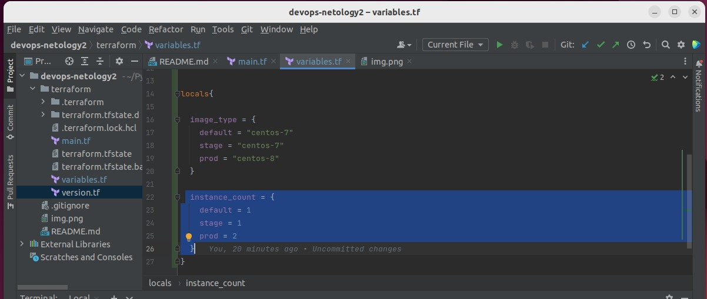

## Домашнее задание к занятию 5.3 ##

### Задача 1. ###

#### Опубликуйте созданный форк в своем репозитории и предоставьте ответ в виде ссылки на https://hub.docker.com/username_repo. ####

https://hub.docker.com/repository/docker/mikhailpastushenko/repo1

### Задача 2. ###

#### Посмотрите на сценарий ниже и ответьте на вопрос: "Подходит ли в этом сценарии использование Docker контейнеров или лучше подойдет виртуальная машина, физическая машина? Может быть возможны разные варианты? ####

1) _Высоконагруженное монолитное java веб-приложение_ - лучше подойдёт отдельная вируальная машина;

2) _Nodejs веб-приложение_ - подойдёт контейнер. Здесь, как и в последующих сценариях, многое зависит от требований приложения к RAM и CPU, так как согласно подходу CloudNative микросервисы должны быть микро- и многие системы оркестрации вообще не разрешают поднимать контейнеры c RAM > 8 Гб, например  ;

3) _Мобильное приложение c версиями для Android и iOS_ - подойдут контейнеры, можно разнести код/функционал разных версий по разным контейнерам

4) _Шина данных на базе Apache Kafka_ - для высоконагруженных промышленных сред лучше использовать кластер из виртуальных машин, а для ненагруженных сред разработки и тестирования можно использовать контейнеры (мы сейчас так используем) ;

5) _Elasticsearch кластер для реализации логирования продуктивного веб-приложения_ - три ноды elasticsearch, два logstash и две ноды kibana - для продуктивного кластера лучше использовать отдельные ВМ;

6) _Мониторинг-стек на базе Prometheus и Grafana_ - лучше использовать контейнеры. (У нас в репозитории компании уже имеются готовые образы контейнеров Prometheus и Grafana, которые разработчики используют  в своих проектах);

7) _MongoDB, как основное хранилище данных для java-приложения_ - виртуальная машина. Базы данных не являются stateless-объектами, поэтому хуже подходят для контейнеризации, тем более как основное хранилище  ;

8) _Gitlab сервер для реализации CI/CD процессов и приватный (закрытый) Docker Registry_  - контейнеры не подходят для хранения файловой информации. Больше подходят кластеры из физических серверов.

### Задача 3. ###

#### Запустите первый контейнер из образа centos c любым тэгом в фоновом режиме, подключив папку /data из текущей рабочей директории на хостовой машине в /data контейнера ####
#### Запустите второй контейнер из образа debian в фоновом режиме, подключив папку /data из текущей рабочей директории на хостовой машине в /data контейнера; ####

#### Подключитесь к первому контейнеру с помощью docker exec и создайте текстовый файл любого содержания в /data ####

#### Добавьте еще один файл в папку /data на хостовой машине ####

#### Подключитесь во второй контейнер и отобразите листинг и содержание файлов в /data контейнера ####

