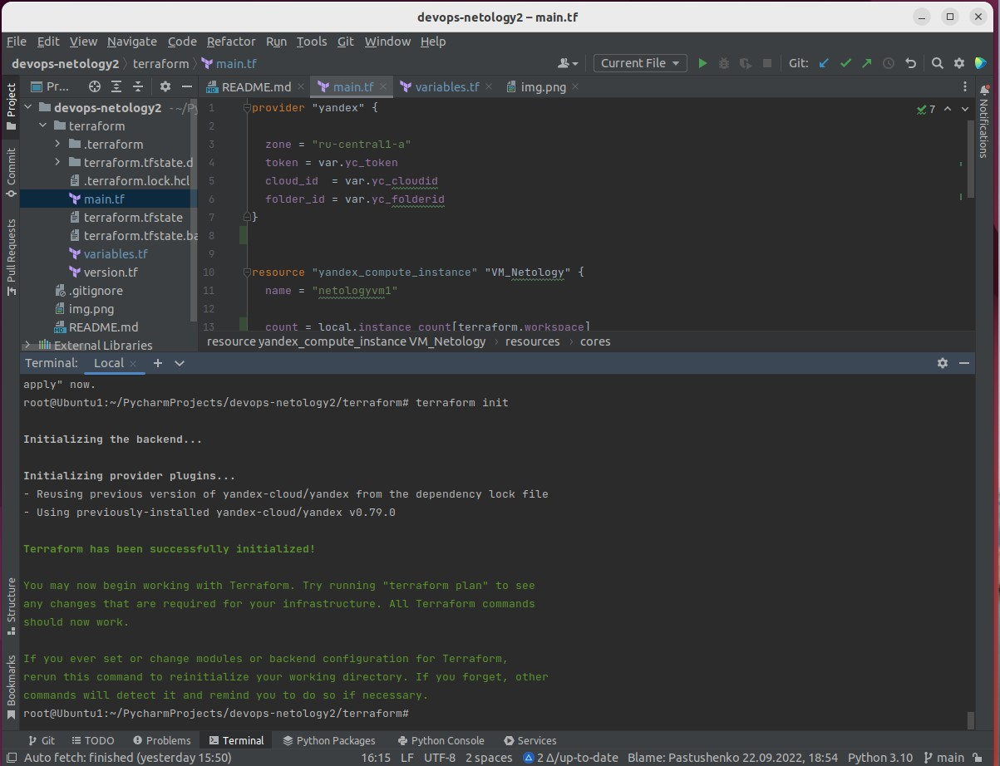

1. **_**На лекции мы познакомились с node_exporter. В демонстрации его исполняемый файл запускался в background. Этого достаточно для демо, но не для настоящей production-системы, где процессы должны находиться под внешним управлением. Используя знания из лекции по systemd, создайте самостоятельно простой unit-файл для node_exporter:
	○ поместите его в автозагрузку,
	○ предусмотрите возможность добавления опций к запускаемому процессу через внешний файл (посмотрите, например, на systemctl cat cron),
	○ удостоверьтесь, что с помощью systemctl процесс корректно стартует, завершается, а после перезагрузки автоматически поднимается.**_**

Скачивание и установка node_exporter

Создание файла службы 

Запуск и добавление в автозагрузку

**_2. Ознакомьтесь с опциями node_exporter и выводом /metrics по-умолчанию. Приведите несколько опций, которые вы бы выбрали для базового мониторинга хоста по CPU, памяти, диску и сети._**

Вывод метрик:

curl localhost:9100/metrics

Опции:

 /usr/local/bin/node_exporter --help

Примеры опций для мониторинга:

 --collector.cpu

 --collector.cpu.info

 --collector.meminfo

 --collector.diskstats

--collector.netstat     

-collector.network_route

**_3.Установите в свою виртуальную машину Netdata. Воспользуйтесь готовыми пакетами для установки (sudo apt install -y netdata). После успешной установки:_**
**_в конфигурационном файле /etc/netdata/netdata.conf в секции [web] замените значение с localhost на bind to = 0.0.0.0,
добавьте в Vagrantfile проброс порта Netdata на свой локальный компьютер и сделайте vagrant reload:
config.vm.network "forwarded_port", guest: 19999, host: 19999
После успешной перезагрузки в браузере на своем ПК (не в виртуальной машине) вы должны суметь зайти на localhost:19999. Ознакомьтесь с метриками, которые по умолчанию собираются Netdata и с комментариями, которые даны к этим метрикам._**

Ознакомление с метриками:

**_4. Можно ли по выводу dmesg понять, осознает ли ОС, что загружена не на настоящем оборудовании, а на системе виртуализации?_**

Можно.  dmesg | sudo -i virtual

В выводе команды выидно, что имеет место виртуализация virtualBox

**_5. Как настроен sysctl fs.nr_open на системе по-умолчанию? Узнайте, что означает этот параметр. Какой другой существующий лимит не позволит достичь такого числа (ulimit --help)?_**

Данный параметр задаёт количество файловых дескрипторов, которые может использовать процесс

Этого значения не позволит достичь лимит, определяющий максимальное количество открытых файлов (/etc/security/limits.conf), который равен 1024

**_6. Запустите любой долгоживущий процесс (не ls, который отработает мгновенно, а, например, sleep 1h) в отдельном неймспейсе процессов; покажите, что ваш процесс работает под PID 1 через nsenter_**

screen

sudo unshare -f --pid --mount-proc top

В самом выводе команды top наблюдаем, что в неймспейсе единственный процесс с pid 1

**_7. Найдите информацию о том, что такое :(){ :|:& };:. Запустите эту команду в своей виртуальной машине Vagrant с Ubuntu 20.04 (это важно, поведение в других ОС не проверялось). Некоторое время все будет "плохо", после чего (минуты) – ОС должна стабилизироваться. Вызов dmesg расскажет, какой механизм помог автоматической стабилизации. Как настроен этот механизм по-умолчанию, и как изменить число процессов, которое можно создать в сессии?_**

Данная команда представляет собой определение и вызов рекурсивной функции, что плодит процессы забирая ресурсы системы

Вывод команды sudo dmesg  после стабилизации:

Pids-контроллер в рамках механизма cgroup останавливает создание новых процессов после достижения лимита

Изменить число процессов,которое можно создать в сессии, можно командой ulimit -u 
